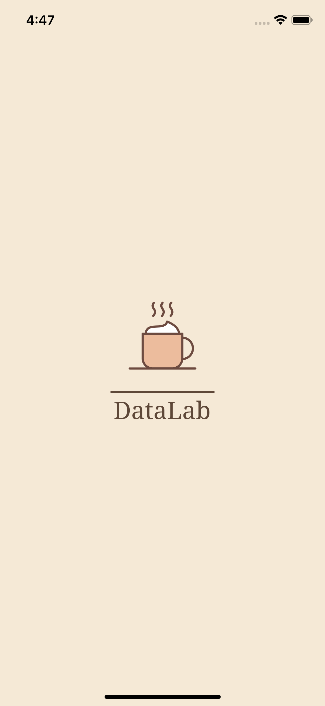
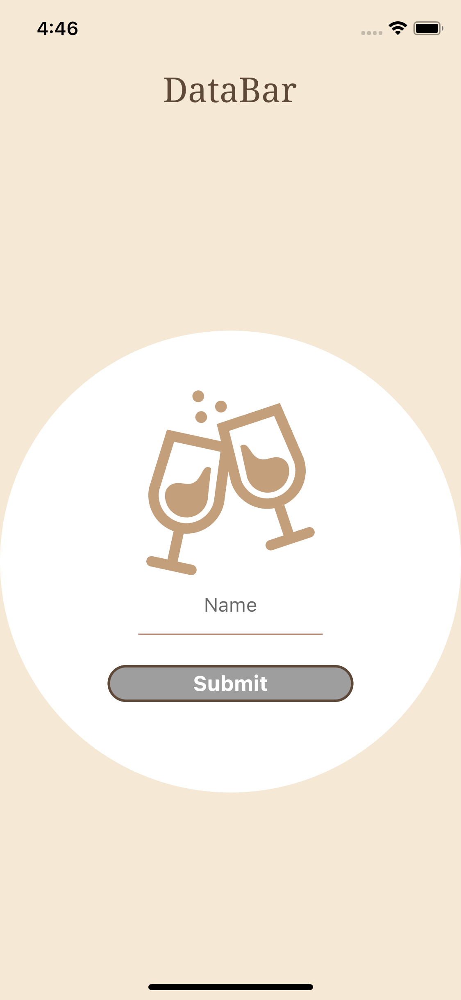
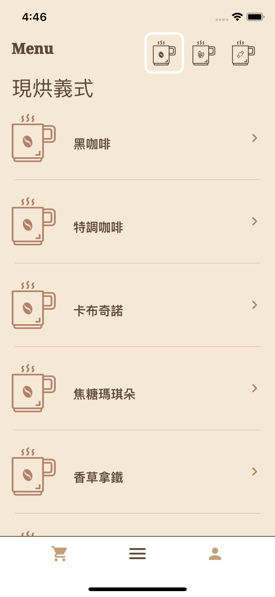
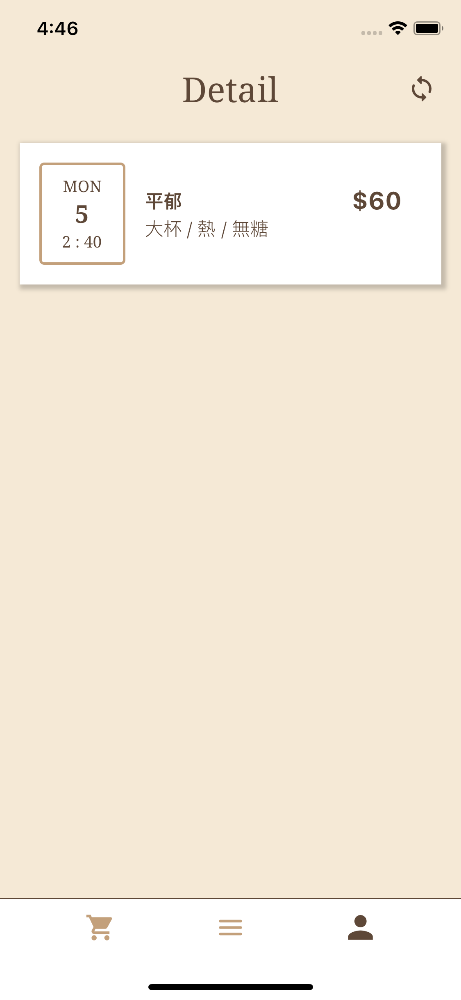
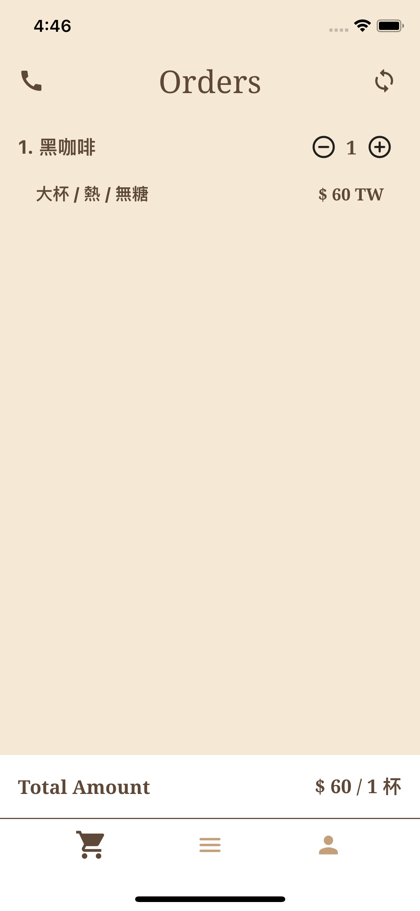

# DataBar
A new datalab drink bot project  

## Api
https://github.com/pin-yu/datalab-drinks-backend

## Change Log
### 2021/4/5 v1.0.2
- API更新
    - 糖與冰塊是否可以調整

### 2021/3/27 v1.0.1
- API從v1切換至v2

### 2021/3/27 v1.0.0
- Datalab點飲料APP

## Development
https://dart.dev/

https://flutter.dev/